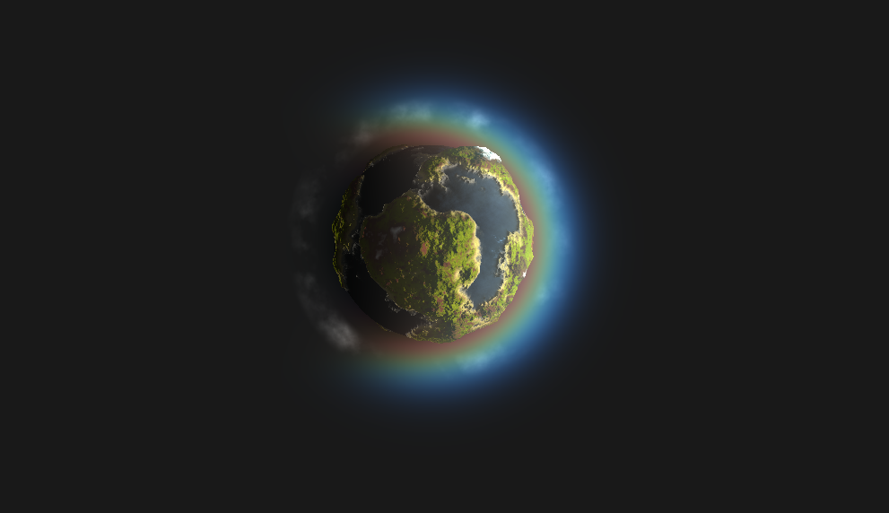
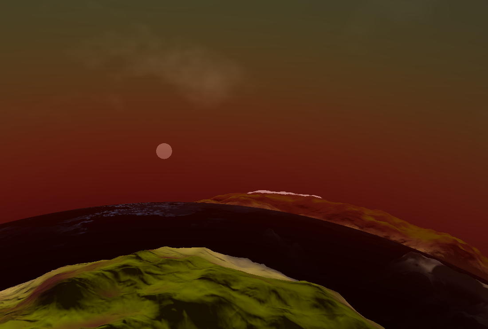
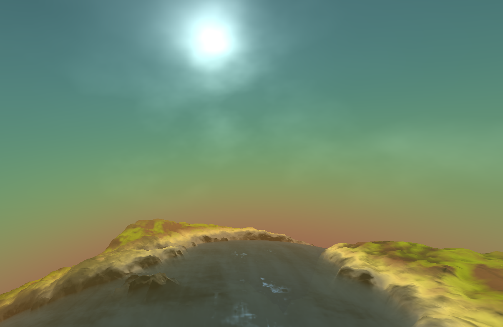

# Procedural Planet
## 50.017 Graphics and Visualisation Project
Team 6
Jeremy Chew 1003301

---
## Introduction

This is procedural planet generator written entirely in C++. It makes use of libraries such as GLFW, GLM, and Dear ImGui in order to build a generator that is able to produce realistic looking planets together with atmospheric scattering and voluminous clouds.

Inspired by Sebastian Lague's [Solar System Coding Adventures](https://www.youtube.com/playlist?list=PLFt_AvWsXl0cSy8fQu3cFycsOzNjF31M1).

## Instructions

The executable is located in `submission/release` and must be run in the same folder.

Move the camera around using WASD. Space to fly up, and Left Shift to fly down.

Render in wireframe mode (Z) or fill mode (X).

Capture the mouse for first-person look-around (C) and release it (V).

Turn on post-processing effects (P) and turn it off (O).

## Compiling
The project has a single dependency: [cmake](https://cmake.org/download/). The other dependencies can be found in the `deps` folder.

In order to generate the project files, you can use your OS-specific CMake command. This will generate the project files which you should be able to simply build and run.

This project was developed on Windows 10 using the build kits from Visual Studio 19. It has not been tested on other platforms.

## Screenshots

